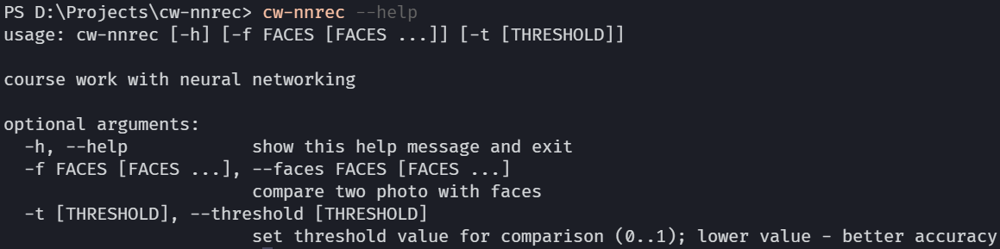
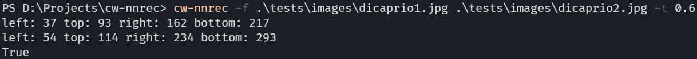
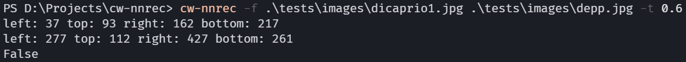

# cw-nnrec

[](https://github.com/andinoriel/cw-nnrec/actions/workflows/build.yml)
[](https://opensource.org/licenses/MIT)

Just a few variants of using neural networks with pretrained models.

## Usage

1. Clone this project and then cd to the project folder;

2. Download trained neural modals:
```
$ python configure.py
```

3. Install the application:
```
$ pip install .
```

4. Run installed application with help message:
```
$ cw-nnrec --help
```

## Testing

Run project tests:
```
$ pytest --verbose
```

## Screenshots

<details>
  <summary>Expand</summary>

  <p align="center">
    
    
    
  </p>
</details>

## License

This project is licensed under the [MIT License](LICENSE).

## Credits

* [Dlib](http://dlib.net/) - ML library
* [alesanfra](https://github.com/alesanfra/dlib-wheels) - for binary Dlib distribution

